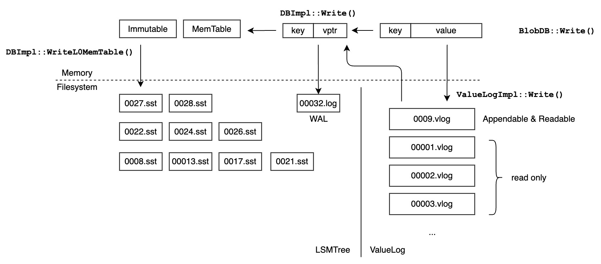

<!-- TOC -->

* [Implementation details](#implementation-details)
    * [BlobDB write](#blobdb-write)
    * [BlobDB read](#blobdb-read)
    * [ValueLog file](#valuelog-file)
    * [ValueLog recovery](#valuelog-recovery)
        * [Validate and reuse latest writable vlog](#validate-and-reuse-latest-writable-vlog)
    * [Garbage collection](#garbage-collection)
        * [Collect](#collect)
        * [Rewrite](#rewrite)
    * [Writer group](#writer-group)

<!-- TOC -->

# Implementation details

1. BlobDB write
2. BlobDB read
3. ValueLog file
4. ValueLog recovery
5. Garbage collection
6. Writer group
7. Concurrent prefetch

## BlobDB write



Interface:

```cpp
Status BlobDB::Write(const WriteOptions& options, WriteBatch* updates,
                     WriteCallback* callback);
```

1. Divide `WriteBatch* updates` into `WriteBatch small` and `ValueBatch large` according to the value size;
2. Write `large` to ValueLog and get the corresponding value pointers(`ValueHandle`).
3. Merge `<key, vptr>`s into `small`.
4. Write `small` to LSMTree.

During the process, we use mutex to protect only step 2. And this is enough
to maintain the consistency.

## BlobDB read

Interface:

```cpp
Status BlobDB::Get(const ReadOptions& options, const Slice& key,
                   std::string* value);
```

1. Read from LSMTree by `key`
2. If what we get is a value(`kTypeValue`), set `value` to it and return.
3. If what we get is a value pointer(`kTypeValueHandle`), read from ValueLog by the pointer.
4. If we get a value from step 3, set `value` to it and return.
5. If we hit a kNotFound error at step 3, get a snapshot from LSMTree and go to step 1.

During the process, we acquire no locks. And it is guaranteed to read the correct/consistent value.
In most cases, we can stop at step2 or step 4. It's rare that we get into step 5 and retry.
We can prove that we retry at most once.

We use *vptr* to refer to value pointer below.

Simple analysis:

1. If we stop at 2, it's safe because the LSMTree internally is thread safe.
2. If we get a vptr at step 2:
    - If GC is disabled, we are guaranteed to read the correct value from ValueLog, because old files will never be
      removed,
      even another thread calls `Write` to update a value between step 2 and step 3.
    - If GC is enabled, the old file pointed by vptr can be removed from disk(`options.snapshot` is NULL). In this case,
      we hit a kNotFound,
      so we get a snapshot from LSMTree and retry. ValueLog guarantees that old files won't be removed from disk
      untill all records in the file is older than the oldest snapshot.

For more implementaion details, read comments of `BlobDB::Get`.

## ValueLog file

.vlog file:

```
 ----------
| record 0 |
 ----------
| record 1 |
 ----------
| record 2 |
 ----------
| record 3 |
 ----------
| record 4 |
 ----------
| record 5 |
 ----------
|    .     |
|   ...    |
|  .....   |
 ----------
| record N |
 ----------
```

record:

```
----------------------------------------------
| KeySize | ValueSize | key |      value     |
----------------------------------------------

KeySize:    VarInt32
ValueSize:  VarInt32
key:        uint8[KeySize]
value:      uinr8[ValueSize]
```

At any time, ValueLog has 1 writable vlog file and multiple read-only
vlog files.

The ValueLog append new records to the end of the writable vlog file. When the file reaches
size limit, it is truncated to a read-only file. And ValueLog will create a new writable file
to server incoming writes.

## ValueLog recovery

The persistent state of ValueLog can be described as follows:

1. read-only .vlog files
2. the latest writable .vlog file
3. obsolete .vlog files
4. next file number (we give each file(.vlog or manifest file) a unique file number)

Similar to original leveldb, ValueLog uses increment recovery.
We use `BlobVersionEdit` to record state change:

1. newly added read-only .vlog files
2. new writable .vlog file
3. newly obsolete .vlog files
4. next file number

* Every time ValueLog fills up current writable file, it creates
  a `BlobVersionEdit`, and (1)add current writable file to read-only files,
  (2) create a new writable .vlog file, (3) record next file number

* Every time ValueLog GC finishes collecting an old file and rewriting to a new file,
  it creates a `BlobVersionEdit`, and (1)add new file to read-only file, (2)add old file to
  obsoleted files.

The BlobVersionEdit will first be appended to current manifest file, and apply to ValueLog.

During BlobDB startup, `ValueLogImpl::Recover` will read manifest file, repeatedly apply
the recorded changes to get to a consistent persistent state.

### Validate and reuse latest writable vlog

After recovery, the ValueLog will validate the latest writable file and
truncate it to the correct size. If its size is smaller than half of the blob_max_file_size,
ValueLog will reuse it instead of creating a new one.

## Garbage collection

Every blob_gc_interval seconds, the GC thread will pick a read-only .vlog file to perform GC.

GC can be divided into two stages: collect and rewrite.

### Collect

During the collect stage, GC thread iterate over all records of the file.

For each record, GC thread query LSMTree to see if the record is expired:

1. Not found
2. LSMTree doesn't return a value pointer
3. the value pointer doesn't point to current record.

The valid(non-expired) records are added to buffer.

### Rewrite

if the discarded size or number of the records reach the threshold,
GC thread will rewrite valid records to a new file.

1. Create a new .vlog file, write valid record to it.
2. Rewrite new value pointers to LSMTree
3. Log and apply BlobVersionEdit to record the change in manifest file.

There are 2 points to be aware:

1. User may update between collect stage and rewrite stage.
2. User may still read from old file because of the snapshot.

For the first, we need to final check if the record is overwritten just
before LSM write to WAL and MemTable. To realize this, I modified DBImpl
to support WriteCallback and WriterGroup (similar to RocksDB)

For the second, the user may hold an old snapshot and can read an old vptr pointing
to the old file. To address this, we just mark the old file as obsoleted. Later, when the
smallest_snapshot of LSMTree is larger than the newest SequenceNumber of records in the old
file, we can remove the old file from disk safely.

## Writer group

For each `DBImpl::Write`, we can specify a WriteCallback, it will be called just
before writing the batch to WAL and MemTable. If the callback returns false, the DBImpl will
not write and return.

However, the callback is bound with the write batch. If the callback is specified,
we lost the benefit of BatchGroup to improve throughput.

What can we do while we want to introduce WriteCallback and still benefit from grouping multiple threads'
writes to avoid frequently acquiring and releasing the mutex?

WriterGroup is to build multiple batch group, so it can group writes with callbacks together.

```cpp
/*
 * db->writers_: [w0|w1|w2|w3|w4|w5|w6|..|..]
 *
 * After BuildWriterGroup:
 *  [ w0 |w1|w2|  w3  |w4|w5|w6|w7|w8]
 *    |          ↑ |            ↑
 *    |  w0.next | |   w3.next  |
 *    |__________| |____________|
 *
 * w0.batch also holds the contents of w1.batch and w2.batch
 * w3.batch holds the contents of w3-w6.batch
 *
 * w0 and w3 are called leaders.
 * w0 is the first leader of the WriteGroup.
 */
struct DBImpl::Writer {
  explicit Writer(port::Mutex* mu)
      : batch(nullptr),
        callback(nullptr),
        sync(false),
        done(false),
        next(nullptr),
        cv(mu) {}

  Status status;
  WriteBatch* batch;
  WriteCallback* callback;
  Writer* next;
  bool sync;
  bool done;
  port::CondVar cv;
};

struct DBImpl::WriterGroup {
  WriterGroup() : first_leader(nullptr), last_writer(nullptr) {}
  Writer* first_leader;
  Writer* last_writer;
};
```

Design：

1. one `DBImpl::Write` writes one `WriterGroup`
2. one `WriterGroup` consists of multiple batch groups
3. `WriterGroup` contains multiple leaders. Leader is the first writer of each batch group.
4. The first leader is called `first_leader`，who is holding CPU control and is able to write to WAL and MemTable.
5. The basic unit that goes into WAL and MemTable is batch group

Grouping principle：

1. A writer with callback forms a batch group. The writer itself is the leader.
2. Multiple continuous writers with no callbacks forms a batch group.
   The leader's batch will contain other writers' batches in this batch group.
3. A writer with no batch(batch==nullptr) forms a batch group. The writer itself is the leader.
4. The writer group stops to grow when its total batch size exceeds the limit, or it already contains all writers in the
   waiting queue.
5. All leaders are linked as a list.